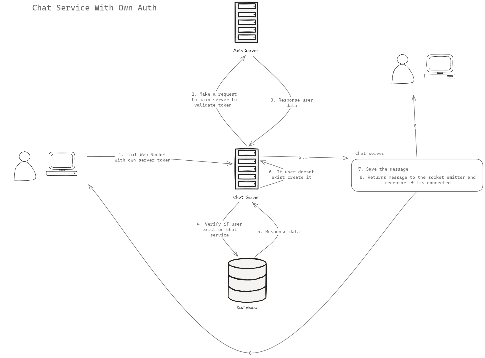

# Chat Server with NestJS

A simple chat server built with NestJS using Socket.IO.

## Installation

```bash
$ pnpm install
```

## Running the app

```bash
# development
$ pnpm run start

# watch mode
$ pnpm run dev

# production mode
$ pnpm run start:prod
```

## Database

The database is managed by [Drizzle](https://drizzle.org/) using PostgreSQL.

Add the following environment variables to your `.env` file replacing the values with your own:

```bash
DATABASE_URL=postgres://<user>:<password>@<host>:<port>/<database>
```

Now you can generate the migrations and apply them to your database:

```bash
npx drizzle-kit push
```

Or run the following commands:

To generate the migrations, run:

```bash
npx drizzle-kit generate
```

And to apply the migrations with:

```bash
npx drizzle-kit migrate
```

## Implementation Diagram



## License

[MIT licensed](LICENSE).
